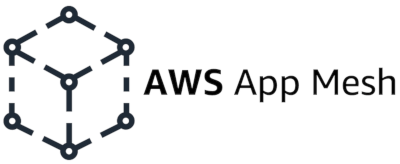

# AWS AppNet Agent




## Usage

The AppNet Agent is designed for use within the App Mesh [Envoy Docker Image](https://docs.aws.amazon.com/app-mesh/latest/userguide/envoy.html) to launch and monitor the Envoy Proxy.


### Building the Agent

On an [Amazon Linux AMI](https://aws.amazon.com/amazon-linux-ami/).  In the project's `agent` directory, issue the `make` command to compile the agent binary:

```
$ yum -y install docker
$ yum -y groupinstall "Development Tools"
$ make
go fmt ./...
APPMESH_RESOURCE_ARN=mesh/test_mesh/virtualNode/test_vn \
        AWS_REGION=us-west-2 \
        go test -v ./...
...
$ ls -laF agent
-rwxr-xr-x 1 agentbuilder amazon 25999336 Jan 18 19:53 agent*
```


To create an Envoy image, you could use the following example files:

Example `Dockerfile.agent`:

```
COPY agent /usr/bin/agent

CMD /usr/bin/agent
```

Example `Makefile`:

```
AWS_REGION ?= us-west-2
SSM_PARAMETER = "/aws/service/appmesh/envoy"
IMAGE_STRING = $(shell aws --region $(AWS_REGION) ssm get-parameter --name $(SSM_PARAMETER) --query Parameter.Value)
ECR = $(shell echo $(IMAGE_STRING) | cut -d / -f 1)
IMAGE_NAME ?= "app-mesh-agent:latest"

.PHONY: docker-build
docker-build:
        ECR=$(shell echo $(IMAGE_STRING) | sed 's/\(.*\):\(.*\)/\1/g')
        echo "FROM $(IMAGE_STRING)" > source
        cat source Dockerfile.agent > Dockerfile

        aws ecr get-login-password | docker login --password-stdin --username AWS $(ECR)
        docker build -t ${IMAGE_NAME) .
        rm source Dockerfile
```

Please these files along with the built `agent` binary in a single directory and issue the `make docker-build` command.  The resulting `app-mesh-agent:latest` can be used in App Mesh as a sidecar.

## Advanced Usage

The AppNet Agent supports using a few environment variable to alter some aspects of the Envoy's behavior.  These variables are outlined below.  Many of these fields are documented in the AWS App Mesh [User Guide](https://docs.aws.amazon.com/app-mesh/latest/userguide/envoy-config.html).


**Required Variables**

|Environment Key	|Example Value(s)	|Description	|Default Value	|
|---	|---	|---	|---	|
|`APPMESH_RESOURCE_ARN`	|	|When you add the Envoy container to a task group, set this environment variable to the ARN of the virtual node or the virtual gateway that the task group represents	|	|

**Optional Variables**

|Environment Key	|Example Value(s)	|Description	|Default Value	|
|---	|---	|---	|---	|
|`APPNET_ENVOY_RESTART_COUNT`	|10	|The number of times the Agent will restart Envoy within a running task	|0	|
|`PID_POLL_INTERVAL_MS`	|25	|The interval at which the Envoy process’ state is checked	|100	|
|`LISTENER_DRAIN_WAIT_TIME_S`	|1	|Controls the time Envoy waits for active connections to gracefully close before the process exits	|20	|
|`APPMESH_RESOURCE_CLUSTER`	|	|By default App Mesh uses the name of the resource you specified in `APPMESH_RESOURCE_ARN` when Envoy is referring to itself in metrics and traces. You can override this behavior by setting the `APPMESH_RESOURCE_CLUSTER` environment variable with your own name. This variable can only be used with version `1.15.0` or later of the Envoy image.	|	|
|`APPMESH_SLEEP_DURATION`	|10	|Duration in seconds to sleep before starting the Envoy image. Used to prevent Envoy starting before Task networking is set up	|5	|
|`APPMESH_XDS_ENDPOINT`	|hostname.aws:1234	|Envoy's configuration endpoint with port	|appmesh-envoy-management.$[AWS_REGION.amazonaws.com:443](http://aws_region.amazonaws.com:443/)]	|
|`APPMESH_SET_TRACING_DECISION`	|<true|false>	|Controls whether Envoy modifies the `x-request-id` header appearing in a request from a client	|TRUE	|
|`APPMESH_SDS_SOCKET_PATH`	|/path/to/socket	|Unix Domain Socket for SDS Based TLS.	|	|
|`APPMESH_PREVIEW`	|<0|1>	|Enables the App Mesh Preview Endpoint	|	|
|`APPMESH_METRIC_EXTENSION_VERSION`	|<0|1>	|Enables the App Mesh metrics extension	|	|
|`APPMESH_PLATFORM_K8S_VERSION`	|“v1.21.2”	|For Envoy running on K8s, K8s platform version injected by App Mesh Controller	|	|
|`APPMESH_PLATFORM_APP_MESH_CONTROLLER_VERSION`	|"v1.4.1"	|For Envoy running on K8s, app mesh controller version injected by App Mesh Controller	|	|
|`ENVOY_CONFIG_FILE`	|/usr/local/etc/envoy.yaml	|Location of an alternative Envoy configuration file. If it is provided, a full and valid config file must be provided to the container. If this is not provided the Agent generates the config file.	|	|
|`ENVOY_RESOURCES_CONFIG_FILE`	|/usr/local/etc/resources.yaml	|Location for providing additional resources to be applied on the bootstrap configuration file.  If this is specified the Agent will concatenate the resources with the default resources that are generated.	|	|
|`ENVOY_ADMIN_ACCESS_LOG_FILE`	|/path/to/access.log	|Log file for the Envoy admin access service	|/var/log/envoy_admin_access.log	|
|`ENVOY_ADMIN_ACCESS_PORT`	|1234	|Port where Envoy admin access is reachable 	|9901	|
|`ENVOY_LOG_LEVEL`	|<info|warn|error|debug|trace>	|Envoy Log Level	|info	|
|`ENVOY_TRACING_CFG_FILE`	|	|Tracing configuration file (see: https://www.envoyproxy.io/docs/envoy/latest/intro/arch_overview/tracing).	|	|
|`ENVOY_STATS_CONFIG_FILE`	|	|Stats config file (see: https://www.envoyproxy.io/docs/envoy/latest/intro/arch_overview/statistics).	|	|
|`ENVOY_STATS_SINKS_CFG_FILE`	|	|Specify a file path in the Envoy container file system to override the default configuration with your own. For more information, see [config.metrics.v3.StatsSink](https://www.envoyproxy.io/docs/envoy/latest/api-v3/config/metrics/v3/stats.proto#config-metrics-v3-statssink) in the Envoy documentation.	|	|
|`ENVOY_INITIAL_FETCH_TIMEOUT`	|	|Length of time Envoy will wait for an initial config response	|0	|
|`ENABLE_ENVOY_XRAY_TRACING`	|<0|1>	|Enables X-Ray tracing using 127.0.0.1:2000 as the default daemon endpoint	|	|
|`XRAY_DAEMON_PORT`	|1234	|Overrides the X-Ray daemon port	|2000	|
|`XRAY_SAMPLING_RATE`	|0.0 - 1.00	|Override the default sampling rate of 0.05 (5%) for AWS X-Ray tracer. The value should be specified as a decimal between 0 and 1.00 (100%). This will be overridden if `XRAY_SAMPLING_RULE_MANIFEST` is specified	|	|
|`XRAY_SAMPLING_RULE_MANIFEST`	|/path/to/ruleset	|Specify a file path in the Envoy container file system to configure the localized custom sampling rules for the X-Ray tracer. For more information, see [Sampling rules](https://docs.aws.amazon.com/xray/latest/devguide/xray-sdk-go-configuration.html#xray-sdk-go-configuration-sampling) in the *AWS X-Ray Developer Guide*	|	|
|`ENABLE_ENVOY_DATADOG_TRACING`	|<0|1>	|Enables Datadog trace collection using `127.0.0.1:8126` as the default Datadog agent endpoint. To enable, set the value to `1`	|0	|
|`DATADOG_TRACER_PORT`	|1234	|Specify a port value to override the default Datadog agent port	|8126	|
|`DATADOG_TRACER_ADDRESS`	|127.0.0.1	|Specify an IP address to override the default Datadog agent address	|127.0.0.1	|
|`DD_SERVICE`	|“mesh/resourceName”	|Specify a service name for traces to override the default Datadog service name. This variable is supported with Envoy image version `v1.18.3.0-prod` or later.	|`envoy-meshName`/`virtualNodeName`	|
|`ENABLE_ENVOY_JAEGER_TRACING`	|<0|1>	|Enables Jaeger trace collection using `127.0.0.1:9411` as the default Jaeger endpoint	|0	|
|`JAEGER_TRACER_PORT`	|1234	|Specify a port value to override the default Jaeger port	|9411	|
|`JAEGER_TRACER_ADDRESS`	|127.0.0.1	|Specify an IP address to override the default Jaeger address	|127.0.0.1	|
|`ENABLE_ENVOY_DOG_STATSD`	|<0|1>	|Enables DogStatsD stats using `127.0.0.1:8125` as the default daemon endpoint	|0	|
|`STATSD_PORT`	|1234	|Specify a port value to override the default DogStatsD daemon port	|8125	|
|`STATSD_ADDRESS`	|127.0.0.1	|Specify an IP address value to override the default DogStatsD daemon IP address.  This variable can only be used with version `1.15.0` or later of the Envoy image.	|127.0.0.1	|
|`STATSD_SOCKET_PATH`	|/path/to/socket	|Specify a unix domain socket for the DogStatsD daemon. If this variable is not specified, and if DogStatsD is enabled, then this value defaults to the DogStatsD daemon IP address port of `127.0.0.1:8125`. If the `ENVOY_STATS_SINKS_CFG_FILE` variable is specified containing a stats sinks configuration, it will override all of the DogStatsD variables. This variable is supported with Envoy image version `v1.19.1.0-prod` or late	|	|

### Deprecated

* `APPMESH_RESOURCE_ARN`
* `APPMESH_RESOURCE_NAME`
* `APPMESH_VIRTUAL_NODE_NAME`

## Security

See [CONTRIBUTING](CONTRIBUTING.md#security-issue-notifications) for more information.

## License

This project is licensed under the Apache-2.0 License.
